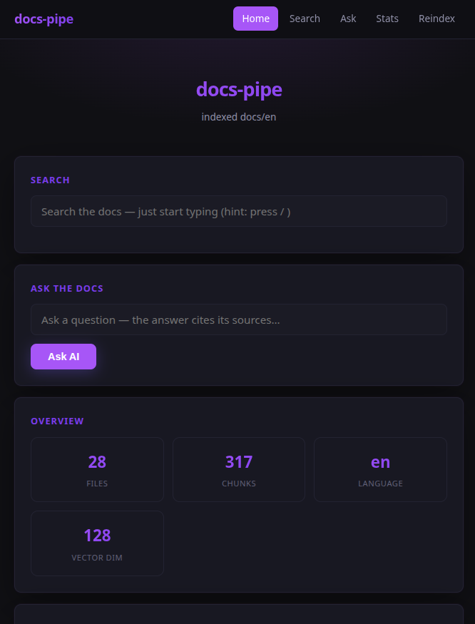
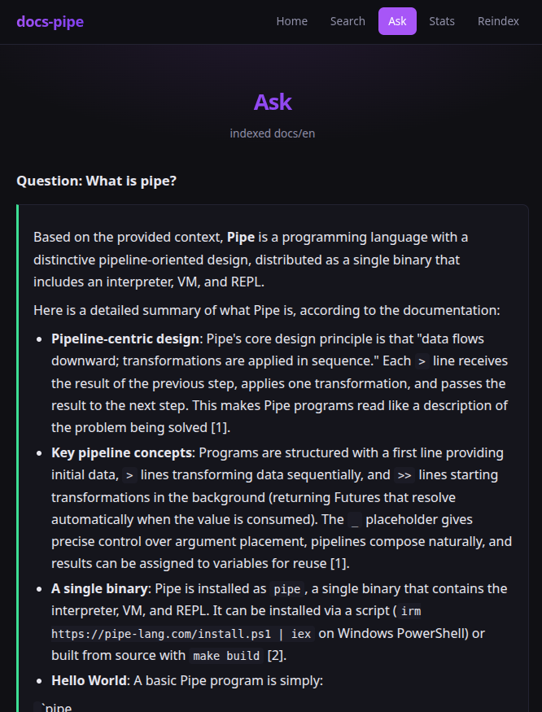
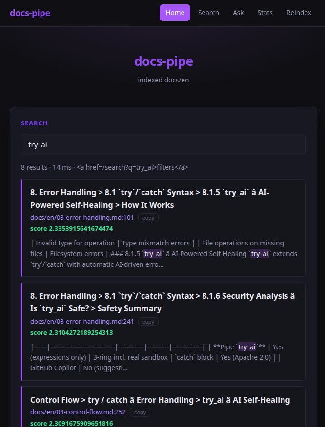
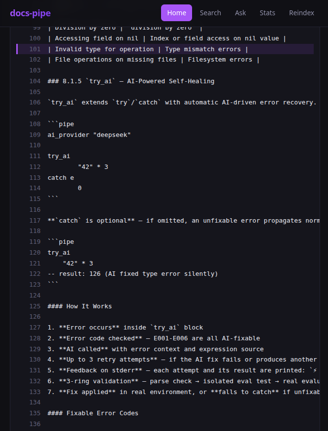

[lang:en]# 🧠 docs-pipe — Turn Your Docs Into a Searchable, Question-Answering AI[/lang]
[lang:de]# 🧠 docs-pipe — Verwandle deine Doku in eine durchsuchbare, Frage-beantwortende KI[/lang]

[lang:en]
**A documentation-native RAG module and a web dashboard — heading-aware chunking, hybrid search, cited answers, and a one-command UI. All in pure Pipe.**

> **Related:** [RAG in ~10 lines](tutorial-local-rag.html) · [Your first MCP server](tutorial-first-mcp-server.html)

Your `docs/` folder is the most underused asset in the repo. It has the answers — but nobody *searches* it, because classic RAG means standing up a stack: a vector database, an embedding SDK, a chunking library, and glue code to wire it together. Then you maintain all of it.

`docs-pipe` collapses that into **one module** (pure Pipe, zero native dependencies) and **one example** that turns it into a dashboard.

## The module: six functions

Install it like any Pipe module:

```bash
pipe -get docs-pipe
```

Then index a Markdown tree, search it by *meaning + keywords*, and ask questions with cited answers:

```pipe
ai_provider "deepseek"
import "docs-pipe"

idx: doc_index "docs/en" {lang: "en", db: "pipe_docs.db"}
print (to_str (doc_index_status idx))     -- {files: 28, chunks: 317, lang: en}

-- Hybrid retrieval: keywords + semantics, fused
for r in (doc_search idx "How does the bytecode VM work?" 3)
    print ((get r "path") ++ ":" ++ (to_str (get r "line_start")) ++ " — " ++ (get r "heading"))

-- Grounded answer, with sources
res: doc_ask idx "What is MCP?" 3
print (get res "answer")                  -- answers and cites [1], [2], [3]

doc_close idx                              -- persist to pipe_docs.db
```

The full API is six functions: `doc_index`, `doc_index_status`, `doc_search`, `doc_ask`, `doc_reindex`, `doc_close`.

**What it does that a naive "embed everything" script doesn't:**

- **Heading-aware chunking.** Documents are split on `#`/`##`/`###` boundaries, fenced code blocks stay intact, and every chunk remembers its file, line range, and heading path (`Bytecode VM > Components > Compiler`). Indexing `docs/en` yields **28 files → 317 chunks**.
- **Hybrid search.** A TF-IDF keyword score and a cosine-similarity score are fused — and the weights adapt automatically: local 128-dim embeddings lean on keywords, OpenAI's 1536-dim embeddings lean on semantics.
- **Cited answers.** `doc_ask` returns the answer *and* the sources (`path:line — heading`), so you can always trace a claim back to the doc.
- **Incremental re-indexing.** Each file is hashed with SHA-256; `doc_reindex` re-chunks and re-embeds only what changed.
- **Works offline.** DeepSeek has no embedding API, so `embed` falls back to a built-in local embedding — indexing and search run with **no API key**. Only `doc_ask` needs one, and a full answer costs about **$0.0002**.

## The dashboard: docs-pipe with a face

`docs-pipe` is the engine; `examples/docs_pipe_dashboard.pipe` is the product. One command:

```bash
make docs-dashboard
```

It builds, indexes `docs/en`, serves on `:8090`, and opens your browser. What you get:

- **Live search** — type and results appear, debounced, with matched terms highlighted and every hit linking to a **source viewer** that scrolls to the exact line.
- **Filters** — by file and language (`en`/`de`), with a result count and millisecond latency.
- **Ask** — a cited answer with the sources rendered below it, each one clickable.
- **Stats** — files, chunks, vector dimension, AI call count, and cost, plus a log of your recent queries.
- **A real menu** — sticky nav, burger menu on mobile, progress bar on every request, copy-to-clipboard buttons.

What it looks like:



*The landing page: live search, the ask box, and index stats.*



*The ask page — a cited answer with its sources below it.*



*Search as you type — results appear debounced, with matched terms highlighted.*



*Click any result to open the source file, scrolled to the exact line.*

The same file doubles as an **MCP server**. Run it with `PIPE_MODE=mcp` and it exposes three tools — `search_docs`, `ask_docs`, `read_doc` — so Claude Desktop, Cursor, or any MCP client can query your documentation directly, in the editor.

```bash
PIPE_MODE=mcp DEEPSEEK_API_KEY=... ./bin/pipe examples/docs_pipe_dashboard.pipe
```

## Honest limits

- **Local embeddings are weaker** than OpenAI's. Semantic recall is *fine* for a docs folder, but if you want best-in-class retrieval, set `ai_provider "openai"`.
- **Search is brute-force** over the in-memory index. It's a few milliseconds for a few hundred chunks and stays snappy into the low thousands — it is *not* a FAISS replacement for a hundred thousand documents.
- The dashboard is a demo, not a multi-tenant service: one process, one index, one query at a time.

## Try it

- Module: [`pipe-modules/docs-pipe`](https://github.com/MachuraHarry/pipe-modules/tree/master/docs-pipe) — 418 lines of pure Pipe.
- Example: [`examples/docs_pipe_dashboard.pipe`](https://github.com/MachuraHarry/pipe/blob/master/examples/docs_pipe_dashboard.pipe).

```bash
git clone https://github.com/MachuraHarry/pipe
cd pipe && make docs-dashboard                            # opens http://localhost:8090
```
[/lang]

[lang:de]
**Ein dokumentations-natives RAG-Modul und ein Web-Dashboard — heading-bewusstes Chunking, hybride Suche, zitierte Antworten und ein Ein-Befehl-UI. Alles in reinem Pipe.**

> **Verwandt:** [RAG in ~10 Zeilen](tutorial-local-rag.html) · [Dein erster MCP-Server](tutorial-first-mcp-server.html)

Dein `docs/`-Ordner ist der am meisten unterschätzte Schatz im Repo. Er hat die Antworten — aber niemand *sucht* darin, weil klassisches RAG einen ganzen Stack bedeutet: eine Vektor-DB, ein Embedding-SDK, eine Chunking-Bibliothek und Kleber-Code. Und dann pflegst du das alles.

`docs-pipe` reduziert das auf **ein Modul** (reines Pipe, null native Abhängigkeiten) und **ein Beispiel**, das daraus ein Dashboard macht.

## Das Modul: sechs Funktionen

Installieren wie jedes Pipe-Modul:

```bash
pipe -get docs-pipe
```

Dann einen Markdown-Baum indexieren, nach *Bedeutung + Keywords* durchsuchen und Fragen mit zitierten Antworten stellen:

```pipe
ai_provider "deepseek"
import "docs-pipe"

idx: doc_index "docs/en" {lang: "en", db: "pipe_docs.db"}
print (to_str (doc_index_status idx))     -- {files: 28, chunks: 317, lang: en}

-- Hybride Suche: Keywords + Semantik, fusioniert
for r in (doc_search idx "Wie funktioniert die Bytecode-VM?" 3)
    print ((get r "path") ++ ":" ++ (to_str (get r "line_start")) ++ " — " ++ (get r "heading"))

-- Fundierte Antwort, mit Quellen
res: doc_ask idx "Was ist MCP?" 3
print (get res "answer")                  -- antwortet und zitiert [1], [2], [3]

doc_close idx                              -- in pipe_docs.db persistieren
```

Die komplette API besteht aus sechs Funktionen: `doc_index`, `doc_index_status`, `doc_search`, `doc_ask`, `doc_reindex`, `doc_close`.

**Was es besser macht als ein naives „alles einbetten"-Skript:**

- **Heading-bewusstes Chunking.** Dokumente werden an `#`/`##`/`###`-Grenzen geteilt, umschlossene Code-Blöcke bleiben intakt, und jeder Chunk merkt sich Datei, Zeilenbereich und Überschriftenpfad (`Bytecode VM > Komponenten > Compiler`). `docs/en` ergibt **28 Dateien → 317 Chunks**.
- **Hybride Suche.** Ein TF-IDF-Keyword-Score und ein Kosinus-Ähnlichkeits-Score werden fusioniert — und die Gewichtung passt sich automatisch an: lokale 128-dim-Embeddings setzen auf Keywords, OpenAIs 1536-dim-Embeddings auf Semantik.
- **Zitierte Antworten.** `doc_ask` liefert die Antwort *und* die Quellen (`path:line — heading`), damit jede Behauptung nachvollziehbar ist.
- **Inkrementelles Indexieren.** Jede Datei wird per SHA-256 gehasht; `doc_reindex` zerlegt und bettet nur Geändertes neu ein.
- **Läuft offline.** DeepSeek hat keine Embedding-API, daher fällt `embed` auf ein eingebautes lokales Embedding zurück — Indexieren und Suchen laufen **ohne API-Key**. Nur `doc_ask` braucht einen, und eine volle Antwort kostet rund **$0,0002**.

## Das Dashboard: docs-pipe mit Gesicht

`docs-pipe` ist der Motor; `examples/docs_pipe_dashboard.pipe` ist das Produkt. Ein Befehl:

```bash
make docs-dashboard
```

Er baut, indexiert `docs/en`, startet auf `:8090` und öffnet den Browser. Was du bekommst:

- **Live-Suche** — tippen und Ergebnisse erscheinen (debounced), Trefferbegriffe markiert, jeder Treffer verlinkt auf einen **Quelltext-Viewer**, der zur exakten Zeile scrollt.
- **Filter** — nach Datei und Sprache (`en`/`de`), mit Trefferzahl und Latenz in Millisekunden.
- **Ask** — eine zitierte Antwort mit den darunter gerenderten, klickbaren Quellen.
- **Stats** — Dateien, Chunks, Vektor-Dimension, KI-Aufrufe und Kosten, plus ein Log deiner letzten Suchen.
- **Ein echtes Menü** — Sticky-Navigation, Burger-Menü auf Mobile, Fortschrittsbalken bei jeder Anfrage, Copy-to-Clipboard-Buttons.

So sieht es aus:


*Die Startseite: Live-Suche, Ask-Box und Index-Statistik.*


*Die Ask-Seite — eine zitierte Antwort mit den Quellen darunter.*


*Suche beim Tippen — Ergebnisse erscheinen debounced, Trefferbegriffe markiert.*


*Klick auf ein Ergebnis öffnet die Quelldatei, gescrollt zur exakten Zeile.*

Dieselbe Datei ist zugleich ein **MCP-Server**. Mit `PIPE_MODE=mcp` stellt sie drei Tools bereit — `search_docs`, `ask_docs`, `read_doc` — sodass Claude Desktop, Cursor oder jeder MCP-Client deine Dokumentation direkt im Editor befragen kann.

```bash
PIPE_MODE=mcp DEEPSEEK_API_KEY=... ./bin/pipe examples/docs_pipe_dashboard.pipe
```

## Ehrliche Grenzen

- **Lokale Embeddings sind schwächer** als die von OpenAI. Semantisches Retrieval ist *in Ordnung* für einen Doku-Ordner, aber für beste Qualität setze `ai_provider "openai"`.
- **Die Suche ist Brute-Force** über den In-Memory-Index. Das sind wenige Millisekunden bei ein paar hundert Chunks und bleibt bis in den niedrigen Tausenderbereich flott — ein FAISS-Ersatz für hunderttausend Dokumente ist es *nicht*.
- Das Dashboard ist eine Demo, kein Multi-Tenant-Service: ein Prozess, ein Index, eine Anfrage gleichzeitig.

## Ausprobieren

- Modul: [`pipe-modules/docs-pipe`](https://github.com/MachuraHarry/pipe-modules/tree/master/docs-pipe) — 418 Zeilen reines Pipe.
- Beispiel: [`examples/docs_pipe_dashboard.pipe`](https://github.com/MachuraHarry/pipe/blob/master/examples/docs_pipe_dashboard.pipe).

```bash
git clone https://github.com/MachuraHarry/pipe
cd pipe && make docs-dashboard                            # öffnet http://localhost:8090
```
[/lang]
